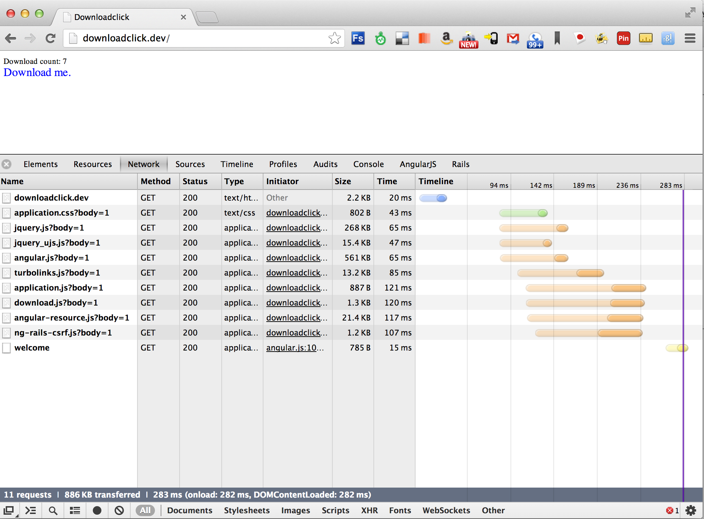
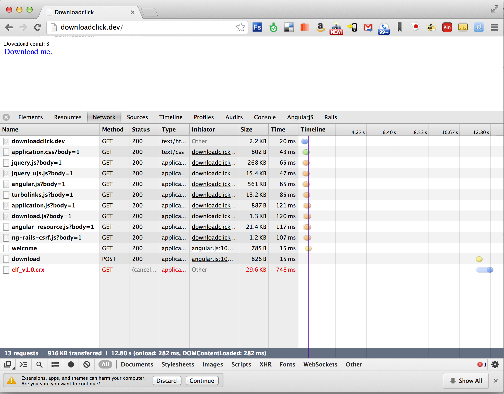

Zoom.Quiet wanted to see how to build a download link counter. This is a rails implementation.

[Link to conversation on Google Groups](https://groups.google.com/forum/#!topic/angular/GEEOnNeE-F0)

On first load of the page, init method calls refresh() which refreshes download number from server

After a click, download counter is adjusted on client side and sent to server.

After request is made, then call window.location.href to send the user to the link

